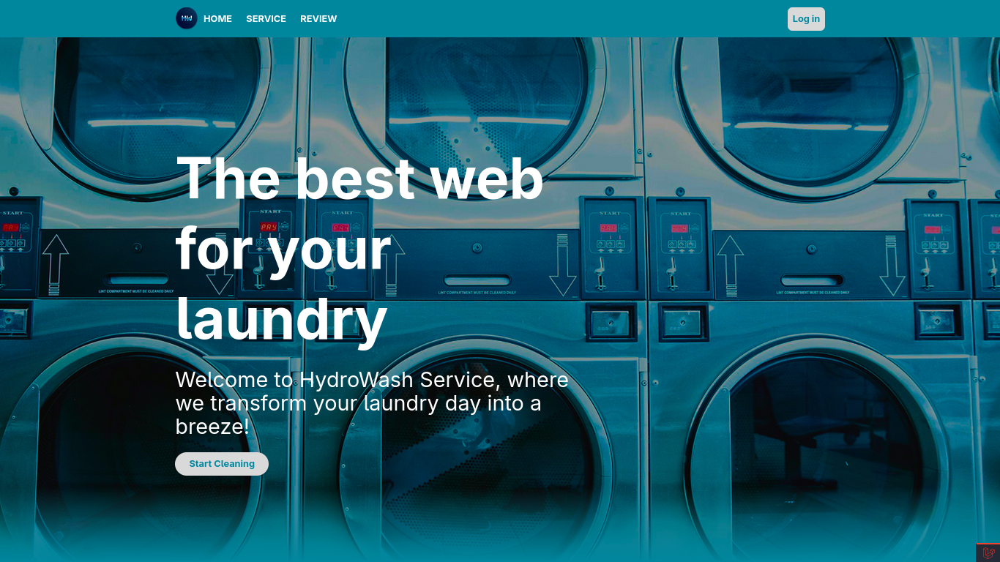

<p align="center">
  
</p>

# 💧 HydroWash - Laundry Web App 🧺


**HydroWash** is a modern, user-friendly web application built with Laravel, designed to digitize and streamline laundry service operations. Whether you're running a small neighborhood laundry or a large-scale business, HydroWash helps you stay organized — from managing orders to tracking deliveries.


## 🚀 Features

- 🔐 **User Authentication & Role-Based Access**
- 📦 **Order Management** – Create, view, update, and track orders in real-time
- 🧑‍💼 **Admin Dashboard** – Manage services, users, orders, and pricing
- 💸 **Dynamic Pricing** – Pricing based on laundry type and weight
- 🚚 **Pickup & Delivery Tracking**
- 🎨 **Modern, Clean UI** – Built with responsiveness and UX in mind

---
## 📸 Preview

<p align="center">
  
</p>


---

## ⚙️ Tech Stack

- **Backend:** Laravel 12  
- **Frontend:** Blade, Bootstrap / Tailwind CSS  
- **Database:** MariaDB

---

## 📁 Getting Started

### 🔧 Installation

Clone the repository:

```bash
git clone https://github.com/Malvin555/hydrowash.git
cd hydrowash
```

Install dependencies:

```bash
composer install
npm install && npm run dev
```

Set up environment variables:

```bash
cp .env.example .env
php artisan key:generate
```

Configure your database in `.env`, then run:

```bash
php artisan migrate --seed
```

Start the local development server:

```bash
php artisan serve
```

---

## 🔐 Default Login Credentials

| Role  | Email             | Password  |
|-------|-------------------|-----------|
| Admin | admin@hydro.com   | admin123  |
| User  | user@hydro.com    | usr123   |

> ⚠️ **Important:** Please update the default credentials after your first login for security.

---

## 📂 Key Folder Structure

- `app/Http/Controllers/` – Core application logic  
- `resources/views/` – Blade templates  
- `routes/web.php` – Web routes  
- `database/seeders/` – Role/user seeders  

---

## 🙌 Contributing

Want to improve HydroWash? You're welcome!  
Fork the repo, create a branch, make your changes, and open a pull request. Please follow Laravel's coding standards and best practices.

---

## 🧼 Why HydroWash?

HydroWash was created to help local laundries embrace digital transformation.  
It boosts efficiency, enhances the customer experience, and enables seamless tracking — all in one place.

---

## 📃 License

This project is licensed under the [MIT License](LICENSE).

---

## 👨‍💻 Built by

**The HydroWash Team**

> ⭐ Star the repo to stay up-to-date with new features!

---
